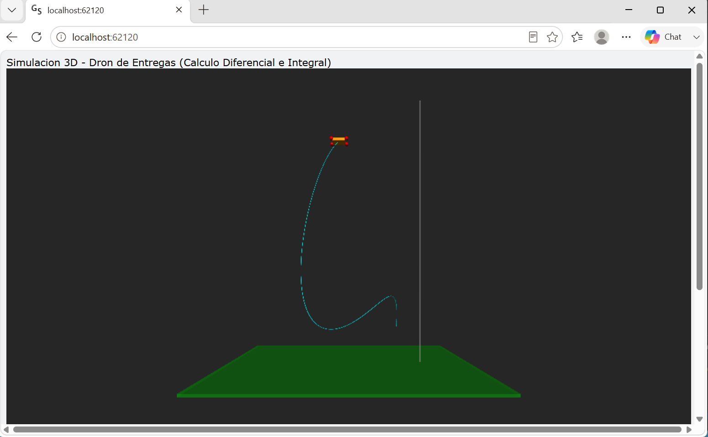
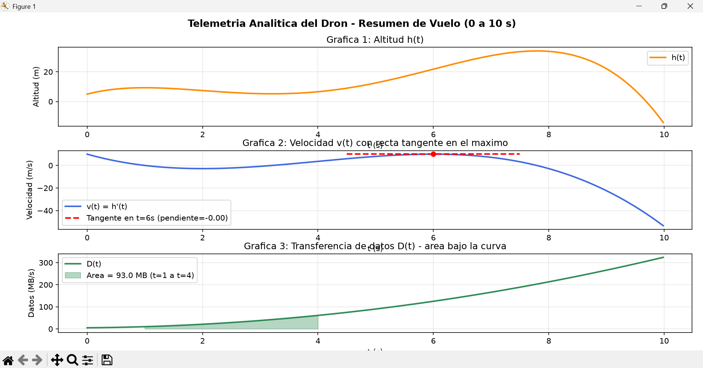

# 🚁 Simulación 3D y Telemetría Analítica de un Dron

## Matemática Aplicada - Tercer Bimestre

Proyecto académico desarrollado para la asignatura de **Matemática Aplicada** de la carrera de **Desarrollo de Software**.

El proyecto consiste en desarrollar un motor de simulación 3D de un dron de entregas utilizando Python, aplicando conceptos de cálculo diferencial e integral para analizar su trayectoria, velocidad, temperatura del motor y transferencia de datos.

---

## 🎯 Objetivo

Desarrollar una simulación 3D de un dron que permita aplicar matemáticamente:

- Derivadas.
- Segunda derivada.
- Velocidad instantánea.
- Puntos críticos.
- Máximos y mínimos.
- Antiderivadas.
- Problemas de valor inicial.
- Integrales definidas.
- Teorema Fundamental del Cálculo.
- Integración numérica.
- Telemetría en tiempo real.

---

## 🛠️ Tecnologías utilizadas

- Python 3.x
- VPython
- NumPy
- Matplotlib
- Git
- GitHub

---

# 📐 Modelo Matemático

## Fase 1 - Altitud del dron

La trayectoria vertical del dron está definida por:

\[
h(t) = -0.1t^4 + 1.6t^3 - 7.2t^2 + 10t + 5
\]

donde:

- `t` representa el tiempo en segundos.
- `h(t)` representa la altitud en metros.

---

## Primera derivada

La velocidad vertical instantánea se obtiene mediante:

\[
v(t) = h'(t)
\]

Por lo tanto:

\[
v(t) =
-0.4t^3 + 4.8t^2 - 14.4t + 10
\]

### Valores importantes

\[
v(2) = -2.8\ m/s
\]

\[
v(6) = 10\ m/s
\]

---

## Segunda derivada

La aceleración vertical se obtiene mediante:

\[
h''(t) =
-1.2t^2 + 9.6t - 14.4
\]

La segunda derivada permite analizar el comportamiento de la función en sus puntos críticos.

---

## Puntos críticos

Los puntos críticos se obtienen resolviendo:

\[
h'(t)=0
\]

Los valores encontrados dentro del intervalo de estudio son:

\[
t=1,\quad t=4,\quad t=6
\]

Las alturas correspondientes son:

| Tiempo | Altura | Interpretación |
|---|---:|---|
| 1 s | 9.3 m | Máximo local |
| 4 s | 7.6 m | Mínimo local |
| 6 s | 21.8 m | Máximo local y máxima altura del vuelo |

Por lo tanto, la máxima altura alcanzada por el dron es:

\[
\boxed{21.8\ m}
\]

---

# 🌡️ Fase 2 - Temperatura del motor

La tasa de calentamiento está definida por:

\[
T'(t)=0.6t^2-2t+4
\]

Al integrar:

\[
T(t)=0.2t^3-t^2+4t+C
\]

Como se conoce que:

\[
T(0)=22
\]

se obtiene:

\[
C=22
\]

Por lo tanto:

\[
\boxed{T(t)=0.2t^3-t^2+4t+22}
\]

---

# 📡 Fase 3 - Transferencia de datos

La transferencia de datos de la cámara 4K está dada por:

\[
D(t)=3t^2+2t+5
\]

en unidades de MB/s.

La antiderivada es:

\[
F(t)=t^3+t^2+5t
\]

Aplicando el Teorema Fundamental del Cálculo:

\[
\int_1^4D(t)\,dt
=
F(4)-F(1)
\]

\[
F(4)=100
\]

\[
F(1)=7
\]

Por lo tanto:

\[
\boxed{100-7=93\ MB}
\]

La integral definida representa la acumulación continua de datos transferidos durante el intervalo de tiempo seleccionado.

---

# 🚁 Simulación 3D

La simulación utiliza **VPython** para representar visualmente el dron.

El movimiento horizontal utiliza una trayectoria circular:

\[
x(t)=4\cos(0.6t)
\]

\[
z(t)=4\sin(0.6t)
\]

Mientras que la altura se determina mediante:

\[
y(t)=h(t)
\]

De esta manera, el dron se desplaza en un espacio tridimensional siguiendo el modelo matemático establecido.

---

# 📊 Telemetría en tiempo real

Durante la simulación se muestran:

- Tiempo actual.
- Altitud `h(t)`.
- Velocidad instantánea `h'(t)`.
- Temperatura del motor `T(t)`.
- Datos acumulados mediante integración numérica.

La acumulación de datos durante la simulación se calcula mediante la **regla del trapecio**.

---

# 📈 Gráficas

Al finalizar la simulación se genera una ventana de Matplotlib con tres gráficas:

### 1. Altitud

Representa:

\[
h(t)
\]

### 2. Velocidad

Representa:

\[
v(t)=h'(t)
\]

Además, se muestra la recta tangente en el punto donde la velocidad alcanza su máximo local.

### 3. Transferencia de datos

Representa:

\[
D(t)=3t^2+2t+5
\]

Se muestra el área bajo la curva entre:

\[
t=1
\]

y

\[
t=4
\]

correspondiente a:

\[
93\ MB
\]

---

# 🖼️ Capturas de la simulación

## Simulación 3D



## Gráficas de telemetría



---

# ⚙️ Instalación

## 1. Clonar el repositorio

```bash
git clone URL_DEL_REPOSITORIO